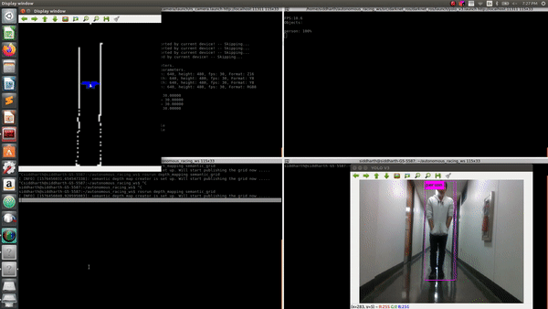

# Semantic and Probabilistic mapping from stereo cameras for active planning and control. 

## Depth mapping

Mapping framework for vision. Using only camera based mapping by converting into point clouds using depth maps. 
Currently tested on Realsense cameras to create probablistic occupancy maps. The launch files can be modified to use the camera of choice and the rostopics of choice. 
The following commands need to be run in order to publish the occupancy map. 
```
roslaunch realsense2_camera rs_camera.launch
```

```
roslaunch depth_mapping depth_3dlaser_realsense.launch
```

```
rosrun depth_mapping grid_builder
```


Pull up rviz in a separate window to subscribe to the map topic. 
Example output: 


## Semantic Mapping

Only detections with more than 95 percent are mapped on the image. The images are saved in the specified location in the semantic_depth.h file in include/depth_mapping/. 

```
git clone https://github.com/Singh-sid930/ros_yolo_depth
```

The above package is needed to publish the depth information and correlated pixel coordinates of the detected bounding boxes. It is a derived from the original darknet_yolo ros implementation by Legged Robotics Lab ETH zurich. 

To run the semantic mapper run the following commands 

```
roslaunch realsense2_camera rs_camera.launch
```
``` 
roslaunch darknet_ros yolo_v3.launch
```
```
rosrun depth_mapping semantic_grid 
```

People are shown as blue. White pixels are unclassified obstacles or obstacles with confidence less than 95 percent. Vehicles are shown as yellow. Everything else will be red. 



