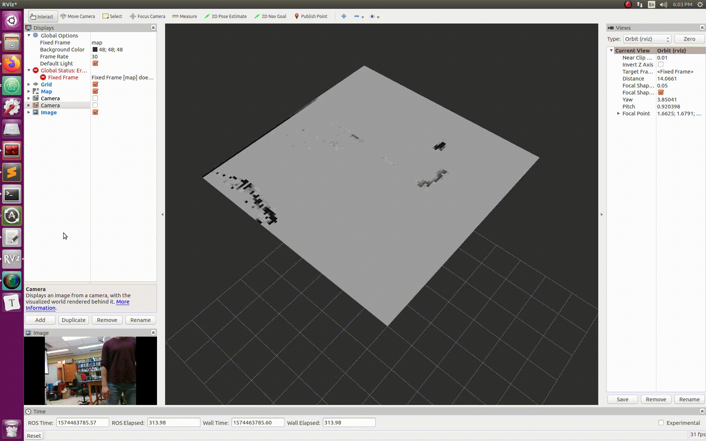

# Semantic and Probabilistic mapping from stereo cameras for active planning and control. 

## Depth mapping

Mapping framework for vision. Using only camera based mapping by converting into point clouds using depth maps. 
Currently tested on Realsense cameras to create probablistic occupancy maps. The launch files can be modified to use the camera of choice and the rostopics of choice. 
The following commands need to be run in order to publish the occupancy map. 
```
roslaunch realsense2_camera rs_camera.launch
```

```
roslaunch depth_mapping depth_3dlaser_realsense.launch
```

```
rosrun depth_mapping grid_builder
```


Pull up rviz in a separate window to subscribe to the map topic. 
Example output: 




